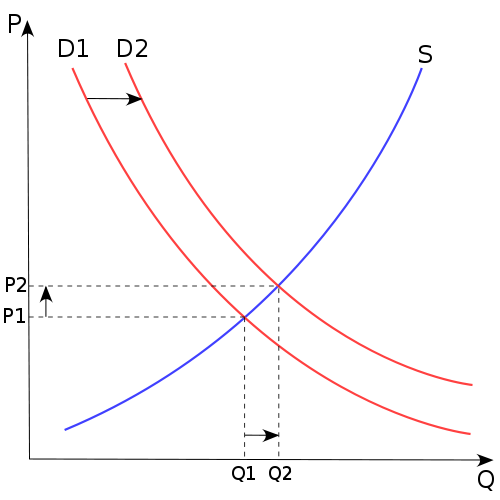

# Preface

>_'Would you tell me, please, which way I ought to go from here?'_  
>_'That depends a good deal on where you want to get to,'_ said the Cat.    
>_'I don't much care where -'_ said Alice.  
>_'Then it doesn't matter which way you go,'_ said the Cat.  
>_'- so long as I get SOMEWHERE,'_ Alice added as an explanation.  
>_'Oh, you're sure to do that,'_ said the Cat, _'if you only walk long enough.'_
>
> --- Lewis Carroll, Alice in Wonderland
  
  
>_"We are our choices."_
>
> --- Jean-Paul Sartre

## Choices, choices, choices {-}

According to Sartre, we are our choices, which implies that we have at least a certain ability to choose what we are. The choices we make have important implications for how we interact with each other and the world. It is a truism to say that we live in a time when resources grow increasingly scarce - when, as a species, we are testing the limits to growth. In this context, the way people make choices is informative about their preferences and where we, collectively, are going. This involves understanding choices, including routine activities, such as deciding how to travel for everyday purposes (for instance walking or cycling, driving, or using transit). But longer term decisions are also of interest, such as the frequency with which we travel by plane; to live in a distant suburb where rent is low but transport is expensive, or in a central city where accessibility is high but space is at a premium; whether to contract more expensive but environmentally less damaging low impact energy sources; whether to buy hybrid, electric, or gasoline vehicles. These are just some examples of the myriads of choices that we all make individually and collectively in the course of a lifetime and that impact the economy, natural environment, and social relationships.

Understanding decision-making is also important to ensure that the world, or more accurately the social institutions that collectively represent us in our interactions with the world, can better accommodate and possibly even nudge or our preferences towards socially desirable outcomes. What do our choices tell us about our long term sustainability as an advanced technological species? What trade-offs are members of the public willing to contemplate when choosing alternative mobility? Is it the range of a new electric vehicle? Or its price? The time it takes to charge its battery? The satisfaction of being green? Should governments subsidize purchases of efficient heating systems? If so, what is the effect of a certain amount in subsidy? Do consumers prefer more range in electric vehicles, and how much are they willing to pay for it? Does the trade-off justify the increase in production costs?

These questions are important for governments and businesses as they try to understand the way the public will respond to taxation, programs, engineering, or production decisions.

In very simple terms, discrete choice analysis is a family of modeling techniques that are useful to understand behavior when there are implicit markets and the decisions concern alternatives that are indivisible and mutually exclusive. In this way, discrete choice analysis represents a form of hedonic price analysis, a tool to understand the preferences of individuals when alternatives are bundles of attributes that may not have explicit prices. 

But what are prices? Broadly speaking, a price is a quantity offered in payment for one unit of a good or service. Economists speculate that early economies were based on bartering. This assumes relatively simple economic systems, and yet ones where people already have stopped being generalists to become specialists of some sort, and therefore sometimes desire to exchange goods and/or services with others. Someone who specializes in making bread probably has only limited time to grow wheat, or to mine salt, or to make shoes. The same thing goes for everyone who has specialized, and cannot meet their needs using only their own labor and resources.

Imagine for instance that you bake bread. Some of your neighbors need bread and may be willing to offer some quantity of something in exchange for it. The person who breeds chicken may be willing to offer one chicken for three loafs of freshly baked bread. Is that a fair exchange? How can anyone determine whether that exchange is sensible? Well, if both parties agree that one chicken is a satisfactory exchange for three loafs of bread, we can maybe say that the price of one loaf of bread is one third of a chicken.

Imagine now that you need someone to mend your roof, and the services of yet another member of your community (who has specialized in going up ladders and thatching) are required for this. How many loafs of bread should you offer this person for making sure that you don't have leaks when it rains? And what if the thatcher has allergies and cannot eat bread?? But maybe this person would agree to do the work if he received chickens in exchange...

As you can imagine, this simple system is unwieldy [and may actually never have existed in reality in this form; see @Graeber2011debt]. Besides the need to coordinate multiple actors in what potentially is a two-way transaction (baker-to-thatcher becomes baker-to-farmer-to-thatcher), the situation is further complicated by bartering's reliance on some kind of trust system: as a a person offering a good or a service in a bartering system, there are no simple ways of ensuring the quality of the exchange! For example, what if the thatcher is a crook, or the farmer gives you diseased chickens in exchange for your top-notch, high-quality, mouth-watering loafs of bread? In small systems, where agents can recognize each other, trust is enforced by reputation - if the thatcher is crooked, or the farmer is known to feed lead to the poultry, other actors can avoid transactions with them. If leaks begin as soon as it begins to rain, people will soon start to avoid doing business with the thatcher.

As these simple examples illustrate, even simple bartering systems are complicated ways of setting prices, something that becomes increasingly difficult (except in very exceptional situations) when an economy produces hundreds, thousands, or even more different products and services.

(An interesting exception is the time when Pepsico bartered with the Soviet Union; [see this news item from 1990](https://www.nytimes.com/1990/04/09/business/international-report-pepsi-will-be-bartered-for-ships-vodka-deal-with-soviets.html). In this case, soft drinks were bartered for ships and vodka. [Why did barter make sense in this situation? Hint: the Soviet ruble's official exchange rate compared to other currencies was more or less meaningless; @Wyczalkowski1950soviet.])

## Price Mechanisms, or, Is Money the Root of All Evil {-}

A sentiment commonly expressed in numerous cultures throughout history is a disapproval of greed. A well-known example is 1 Timothy 6:10, which warns us that the love of money is the root of all of evil. And while love of money for its own sake may not strike us as virtuous, it is almost certain that no complex economy can exist without the invention of money. The complexities of bartering make clear the need for a common standard for exchange. Instead of needing to figure out how many shoes a chicken is worth and how many chickens a new roof, everything is measured using the same metric: shells, [deer leather](https://commons.wikimedia.org/wiki/File:Tang_Dynasty_30_Kuan_banknote.jpg), rupees, pesos, [bilimbiques](https://es.wikipedia.org/wiki/Moneda_revolucionaria), or dollars.

The limitations of bartering help to explain (if in a somewhat simplistic fashion) the necessity of monetary systems. A common currency frees the maker of shoes from the need to calculate the cost of his new roof in chickens. But it does not explain how prices are set in the common currency.

Price mechanisms depend to a large extent on the institutional framework. Several such frameworks exist.

For example, in a centrally planned economy, prices for goods or services are set by a designated agent. This could be the Elder of the Village. The Elder of the village decides how many pesos people should pay for your shoes (alternatively, how much you can charge for a pair of shoes), and how much you should pay a thatcher for each hour of work. Everyone in this kind of setup prays that the Elder of the Village knows what he is doing, and the potential for mistakes clearly is far from negligible. In the Soviet Union prices were set using so called _material balances_, which aimed at balancing the inputs to the planned outputs. As history shows, this approach was not successful. There are several reasons for this, including ideological limitations in the mathematical tools used to calculate balances, as well as the inherent limitations of such planning, which does not allow for deviations from the plan (what if you end up needing _two_ pairs of shoes instead of only one or none?).

In a free market economy, on the other hand, prices are left to float with no intervention from central planning agencies. There is a voluminous literature explaining how this system can allocate resources efficiently. Although much of this literature is riddled with fantasies that wish away externalities and other market failures, it does contain numerous valuable insights, including the notion that prices are signals of how desirable a good or service is, and how much of it is available. 

Economists explain this relationship using a relationship between demand and supply. 

The basic assumption (which happens to hold in many cases) is that the level of demand for a good or service (the quantity that consumers are willing to purchase) declines as the price increases. On the side of producers and providers of goods and services, the level of supply (the quantity that they are willing to produce) increases with price. Demand and supply, then, are influenced by price, but they do not happen in isolation - rather, they interact to set prices. A consumer cannot single-handedly demand that a good/service be sold at a certain (i.e., low) price when many consumers are willing to pay a somewhat higher price for the same (otherwise one could buy a brand new PlayStation5 for 25 dollars). Likewise, a producer/provider cannot expect to set a high price for a good/service when other producers are willing to sell at a lower price. There are aberrant situations and exceptions, of course. Monopolies and cartels can manipulate prices on behalf of producers, whereas single-payer health care manipulates prices in favor of patients.

The intersection of the supply and demand curves determines simultaneously prices _and_ the quantity of a good/service produced/consumed. Since prices "float", they can adjust to changes in supply and/or demand. In Figure \ref{fig:supply-demand-figure}, for example, when demand for a good or service (say roofs) increases, there is an incentive for thatchers to work more hours. Since there is a limited number of hours that thatchers can work (there is scarcity), this is reflected in a higher price, as long as those who can afford it are willing to pay more for a scarce but desirable service.

```{r supply-demand-figure, echo=FALSE, fig.align='center', fig.cap="\\label{fig:supply-demand-figure} Supply and demand relationships", out.width = "50%"}
#R render map for output

```

A third system is a mixed economy, where prices are left to float but within limits or with other corrective mechanisms, such as subsidies or taxes.

The most familiar situation for most of us of price mechanisms would be in the form of free or mixed economies, after centrally planned economies collapsed or adapted towards the end of the 20th century. An underlying assumption in these systems is that a market exists for the good or service in question, that is, a medium where goods or services can be exchanged. Markets exist for many things: for milk, for bread, for insurance, and for complex financial instruments that no one really understands, such as derivatives. On the other hand, markets do not explicitly exist for composite products or services, and therefore the willingnes to pay of consumers for _elements_ of a specific good cannot be discerned directly. (In reality, even something seemingly simple as milk can be seen as a bundle: the brand, the fat content, addition of vitamins, etc.)

Imagine, for instance, a good such as an automobile. Automobiles are composite goods in the sense that, even if their purpose is to provide enhancements to the natural capabilities of humans for movement, they can do this in many different ways to satisfy a diversity of needs or tastes: with variations in leg room, differences in acceleration, and various levels of fuel consumption, to name a few. Pricing mechanisms for the whole good (the vehicle) leave the question of willingness to pay for specific components in the dark. How much are consumers willing to pay for extra leg room, more spacious seats, or horsepower? The markets for each of these items are implicit in the market for automobiles.

In fact, hedonic price analysis was invented to address precisely such questions by Andrew Court, an economist for the Automobile Manufacturers' Association in Detroit from 1930 to 1940  [see @Goodman1998andrew]. As part of his work for the Association, Court realized that price indexing procedures were not satisfactory for describing the relative importance of various components of automobiles in determining their price. This in turn was important to understand consumer preferences and to help producers in their efforts to differentiate products.

Court used the term "hedonic" to express the usefulness and desirability (related to pleasure) that consumers attach to different aspects of a composite product. Although Court invented his method in the late 1930s, it lay dormant for approximately twenty years until it was popularized by Zvi Griliches in the 1960s, with work on fertilizers and automobiles [@Griliches1991hedonic]. Later on, Sherwin Rosen explained implicit markets within an economic foundation of supply and demand in equilibrium - that is, not just as willingness to pay on the side of consumers, but also as the result of decisions by producers [@Rosen1974hedonic]. In brief, Rosen explained how the differentiated hedonic price function represents the envelope of a family of "value" functions (willingness to pay) and a family of offer functions (willingness to sell).

Since then, many uses have been found for hedonic price analysis, with applications ranging from the pricing of computers [@Berndt2001price], to personal digital assistants [@Chwelos2008faster], wine [@Unwin1999hedonic], online purchases [@Clemons2002price], and farmland [@Isgin2006hedonic]. 

The field of discrete choice analysis is concerned with the analysis of implicit markets when the outcome of the choice process is discrete. This requires a few things:

1. A decision-maker who can choose between at least two, and possibly more alternatives. If only one alternative is available, the decision-maker does not face a choice situation. The decision-maker is assumed to act in a consistent way that economists call _rational_. Basically, the decision-maker is assumed to always try to maximize the _utility_ (the hedonic value) that they derive from making a choice. The framework allows for seemingly inconsistent behavior by decomposing the utility into two parts, one of which is random, hence the commonly used term _random utility modeling_. 

2. Importantly, the available alternatives must be mutually exclusive and individually indivisible. A decision-maker cannot choose only _part_ of an alternative: it is an all-or-nothing proposition, hence the choice is _discrete_.

Discrete choice analysis as a sub-discipline of econometrics, statistics, and data analysis, has evolved from its origins in psychology and economics, into a set of highly refined and sophisticated tools to infer the willingness to pay for the implicit attributes of discrete goods or services. This book is meant to serve as a gentle introduction to this fascinating field, and its practical implementation using the `R` computer language for statistics and data analysis, according to the following plan.

## Plan {-}

The plan with these notes is to introduce discrete choice analysis in an intuitive way. To achieve this, we use examples and coding, lots and lots of coding. There are numerous books that can be and are used to teach and learn discrete choice analysis. There are some classical references, for instance Ben-Akiva and Lerman [-@Benakiva1985discrete] and Train [-@Train2009discrete], and then more specialized books such as Louviere et al. [-@Louviere2000stated]. Other books cover discrete choice analysis as one component of modeling systems [such as transportation; see @Ortuzar2011modelling], or cover related topics but from a statistical perspective [@Maddala1983limited]. The present book should be appealing to students or others who are approaching this topic for the first time, and we strongly encourage readers to become acquainted with the classical references mentioned above in due course, if they have not already. 

Each author organizes topics in a way that is logical to them. Some texts begin with a coverage of fundamental mathematics, probability, and statistics. Others with an introduction to a substantive topic (e.g., the context of travel demand analysis). In the book _Applied Choice Analysis: A Primer_ by Hensher et al. [-@hensher2005applied], the title of Chapter 10 is "Getting Started Modeling". Train [-@Train2009discrete], in contrast, begins by discussing the properties of discrete choice models and discussing the logit model right away.

For presentation we have in the past relied heavily on Train's book to organize graduate seminars. We find this style of presentation sufficiently intuitive, when combined with some relevant topics introduced at key points. For example, we find that it makes sense to have a discussion of specification and estimation of models after introducing the logit model. In this way, the details of specifying utility functions can be presented in the context of an operational model. Readers will notice that the organization of the book tends to follow Train closely, using a thematic approach, starting from the fundamentals (both technological and technical), before introducing the logit model, and then by families of models, i.e., GEV, probit, and so on.

Beginning early in the text, readers are asked to get their hands dirty with code and data. This is a very deliberate decision. Most books on discrete choice analysis are software-independent, meaning that they cover the topics without making reference to a particular statistical package for analysis. Others rely for presentation on a specific software. For instance, Hensher et al. [-@hensher2005applied] refer extensively to the software `NLOGIT`, a software package sold by [Econometric Software, Inc.](http://www.limdep.com/). Yet other packages were originally developed independently of a statistical computing project. One example is Michel Bierlaire's [BIOGEME](http://biogeme.epfl.ch/). Not being associated with a statistical computing project means that synergies with other packages cannot be realized. Newer versions of BIOGEME now exist written almost exclusively in Python which allow the package to benefit from the Python Data Analysis Library [Pandas](https://pandas.pydata.org/).

For this text, we have chosen the `R` statistical computing project. `R` is a generalist statistical language with a broad user base. We personally find `R` more accessible than Python, for example, as an introduction to statistical and data analysis computing, particularly with the support of a good Interactive Development Environment such as [RStudio](https://www.rstudio.com/). 

Packages (the fundamental units of shareable code in `R`) benefit from the synergies of many developers and users sharing their code in a transparent and open way. Ten years ago it would have been very difficult to write a book on discrete choice modeling based on `R`: the earliest version of Croissant's `mlogit` package [@Croissant2019mlogit] dates from 2009; the earliest version of Sarrias and Daziano's `gmnl` package [@Sarrias2017multinomial] dates from 2015. Now there are mature, well-tested packages to support discrete choice analysis in this language.

In addition, `R` and related packages are free. It is our conviction that research can be accelerated by the generous contributions of developers who graciously share their code with the world. By doing this, they help to maintain the cost of research low, and thus enable more people around the world to engage in it. That said, there is a potential disadvantage: unlike more established (especially commercial) packages that have been kicking around for years if not decades, newer `R` packages may still have some limitations. To mention one, earlier versions of the packages `mlogit` and `gmnl` were implemented for universal choice sets, in other words, under the assumption that all alternatives are available to all decision-makers. There are situations, where this is not realistic; for example, suppose a decision-maker who does not have a bus stop within walking distance of the origin of their trip. It is not reasonable to include the mode "bus" as part of their choice set. That said, the advantages in our opinion far outweigh the disadvantages, especially for an introductory course that can serve as a launchpad before approaching more sophisticated and powerful implementation of discrete choice analysis in `R`, such as [Apollo](http://www.apollochoicemodelling.com/manual.html).

Our plan for this text is to cover a topic in each section that builds on previous material. We have used the materials presented in this book (in different incarnations) for teaching discrete choice analysis in different settings. These notes are used in the course **GEOG 738** _Discrete Choice and Policy Analysis_ that Antonio Paez teaches at McMaster University. This course is a full (Canadian) graduate term, which typically means 11 or 12 weeks of classes. The course is organized as a 2-hour seminar that is offered once per week. Accordingly, each section is designed to cover very approximately the material that required for a 2 hour seminar. The notes are also used in the course **CIV 6719** _Transport demande modelling_ at Polytechnique Montreal, taught by Genevieve Boisjoly. It is a graduate course offered within the transport specicialization of the civil engineering programs. It follows the typical gradute course structure, which comprises 13 sessions of 3 hours, one per week. This leaves a lot of room for in-class exercises, discussions and classwork. 

## Audience {-}

These notes were designed to support a graduate course, but are not necessarily limited to graduate students, and could indeed be a valuable resource to senior undergraduate students, instructors teaching discrete choice analysis, practitioners, experienced discrete choice modelers who wish to transition to the `R` ecosystem, and applied researchers. Discrete choice analysis has applications in economics, geography, travel behavior, residential choices, urban planning, transportation, and public health, to name just a few relevant disciplines, and this book should be of interest to people conducting empirical research and policy analysis in these fields. The prerequisites for using this book are an introductory college/university level course on multivariate statistics, ideally covering the fundamentals of probability theory and hypothesis testing. Working knowledge of multivariate linear regression analysis is a bonus but not strictly required. 

We do not assume previous knowledge of `R`, and instead take what we hope is a gentle approach to introducing it in an intuitive way. The philosophy of the book is to start doing data analysis early and use many practical examples to explain the key concepts of discrete choice analysis. The availability of open software, in our case `R`, means that the book can take a more practical approach to teach and learn than some of the older classics that predate many software packages (e.g., Ben Akiva and Lerman’s classic Discrete Choice Analysis: Theory and Application to Travel Demand). By embedding the topic of discrete choice analysis into the larger `R` ecosystem, the skills developed by readers can be easily transferred and augmented with advanced data management, processing, and visualization techniques, in addition to having access to a multitude of datasets for practice purposes. The book begins with basic data analysis skills (with an emphasis on how to conduct meaningful and easy-to-communicate descriptive analysis that includes both continuous and discrete variables) and continues to discrete choice statistical modeling (from simple binomial logit model to more complex mixture models). It also includes a wealth of material on the interpretation and presentation of results, including through predicted probabilities and scenario analysis.  

## Requisites {-}

This book is not a course to learn `R`. The language is introduced progressively, and assumes that readers are computer-literate and have possibly done some basic coding in the past. For readers who wish to learn basic and advanced `R`, there are other other valuable resources such as Wickham and Grolemund [-@wickham2016r](https://r4ds.had.co.nz/) or Albert and Rizzo [@Albert2012r].

To fully benefit from this text, up-to-date copies of [R](https://cran.r-project.org/) and [RStudio](https://www.rstudio.com/) are highly recommended. There are different packages that implement discrete choice methods in `R`. We will particularly rely on the packages [`mlogit`](https://CRAN.R-project.org/package=mlogit) and [`gmnl`](https://CRAN.R-project.org/package=gmnl). Skills developed by the use of this book serve as a launching pad to later jump to more sophisticated, if more demanding, packages such as Hess and Palma’s [Apollo](http://www.apollochoicemodelling.com/manual.html).

## References {-}
